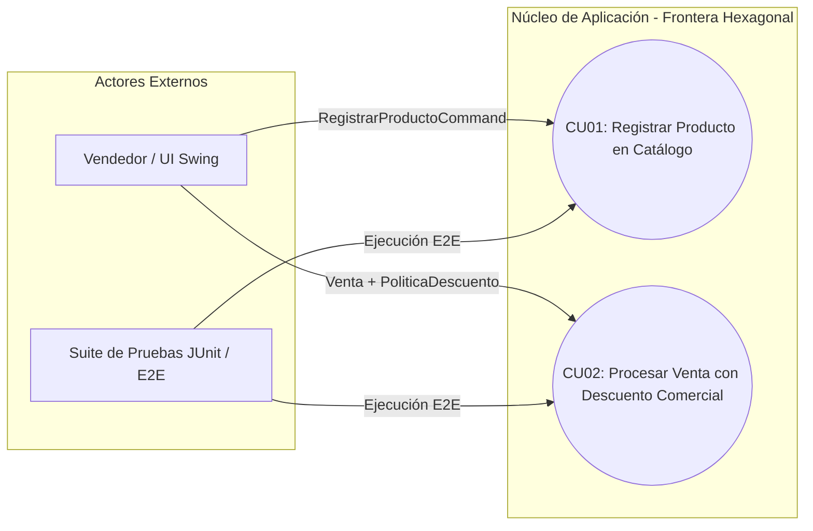
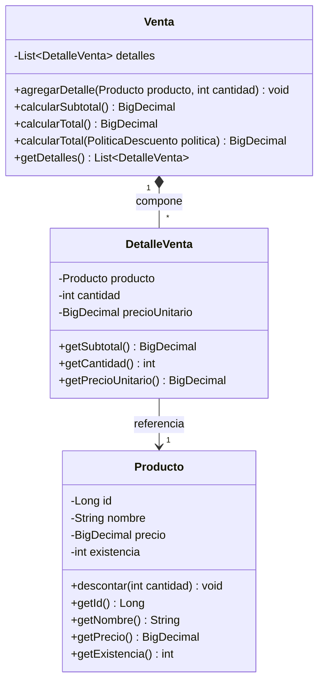
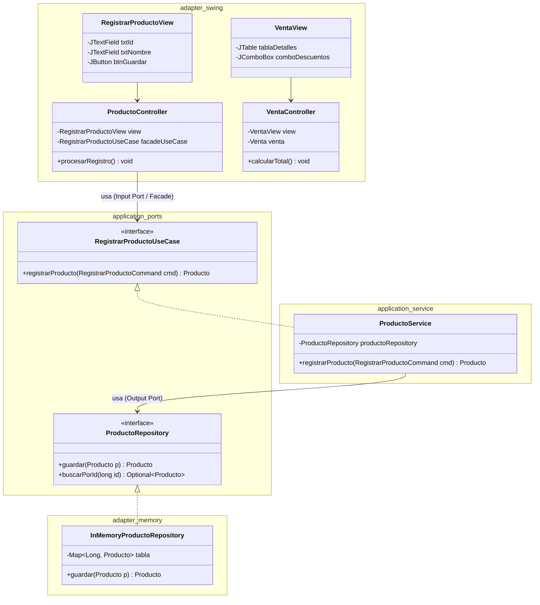
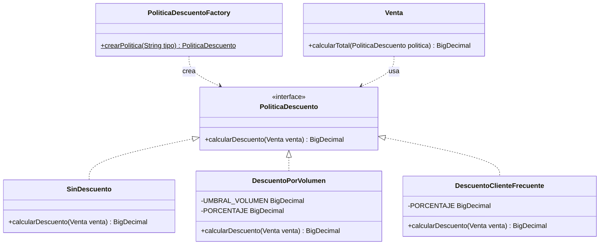
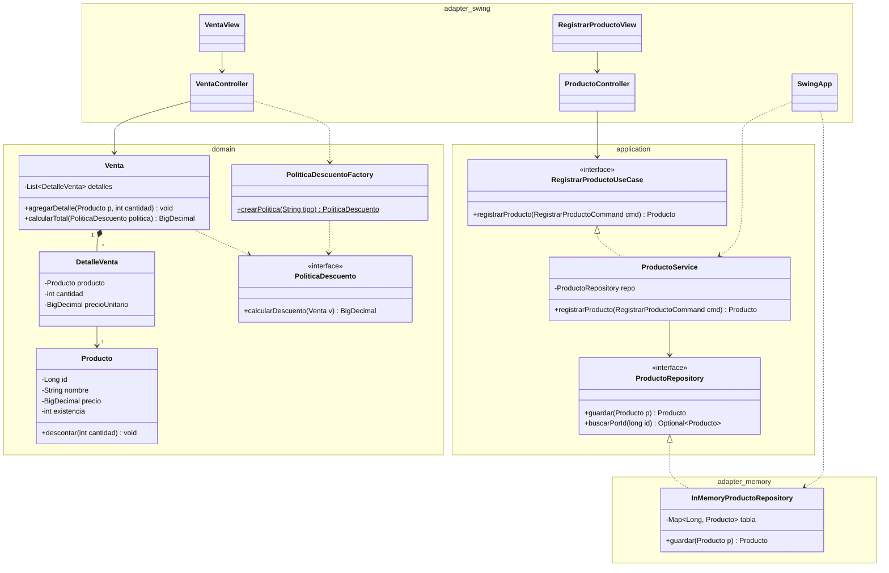

# C01 / P07: Reporte Integrador de Arquitectura y Cliente Swing

* **Universidad Veracruzana** | Facultad de Negocios y Tecnologias
* **Experiencia Educativa:** Tecnologias para la Construcción de Software (TCSW-19234)
* **Proyecto:** Prototipo de Sistema de Ventas (`tcsw-ventas`)
* **Módulos Integrados:** M07 y Corte 1: Arquitectura
* **Docente Responsable:** Dr. Gabriel Rodríguez Vásquez
* **Autores:** Francisco Ramos, Ana Reyes, Victor Reyes. 
* **Versión / Tag:** `corte1-v1.0.0`

---

## 1. Introducción y Propósito del Incremento

El proyecto **`tcsw-ventas`** consolida su desarrollo incremental extendiendo el núcleo de negocio construido en el primer corte (**C01**) mediante la incorporación de una interfaz gráfica en **Java Swing**. El objetivo de este incremento no es modificar ni alterar las reglas comerciales ya probadas, sino conectar un nuevo **Adaptador de Entrada** en el paquete de infraestructura `adapter.swing`, poniendo a prueba el desacoplamiento efectivo de la **Arquitectura Hexagonal** ya implementada anteriormente.

Para lograr una integración limpia y sin acoplar el dominio a tecnologías visuales, nosotros nos fundamentamos en los siguientes patrones y las decisiones de diseño:

* **Inversión de Dependencias y Fachada de Aplicación-*Facade*:** La interfaz visual desconoce la lógica interna del negocio por lo que únicamente se comunica con el caso de uso (`RegistrarProductoUseCase`) a través de objetos de transferencia neutros y que no son modificables (`RegistrarProductoCommand`).
* **Patrón MVC:** Separa las vistas Swing puras (`RegistrarProductoView`, `VentaView`) de sus controladores (`ProductoController`, `VentaController`), encargados de capturar eventos, validar entradas numéricas y desplegar notificaciones con `JOptionPane`.
* **Descarte de Singleton e Inyección en EDT:** Se evitó el patrón Singleton para prevenir estado global oculto y mantener la independencia de las pruebas unitarias porque las dependencias se inyectan explícitamente por constructor en `SwingApp.java`, arrancando la GUI de forma segura en el hilo de eventos de Swing.
* **Strategy & Factory Method:** Permiten conmutar dinámicamente las políticas de descuento (`PoliticaDescuentoFactory`) en la tabla de ventas (`JTable`) sin alterar la entidad `Venta` ni usar estructuras `if/else`, respetando el principio Abierto/Cerrado (OCP).

De este modo, el sistema ofrece una interfaz interactiva y amigable asegurando que el núcleo del dominio permanezca 100% inmutable, aislado y protegido.

---

## 🎭 2. Casos de Uso del Sistema

Los casos de uso expresan las capacidades del núcleo del sistema aisladas de tecnologías de interfaz de usuario o ya sea de bases de datos relacionales.

### 2.1. Diagrama UML de Casos de Uso Actualizado



### 2.2. Especificaciones Formales de Casos de Uso

#### **CU01: Registrar Producto en Catálogo**
* **Actor Primario:** Vendedor / Administrador (a través de `RegistrarProductoView` / `ProductoController`).
* **Propósito:** Registrar un nuevo producto en el catálogo garantizando el cumplimiento de sus invariantes de consistencia (`id > 0`, `precio >= $0.00`, `existencia >= 0`, `nombre` no nulo/vacío).
* **Precondiciones:** El identificador del producto (`id`) debe ser un número entero positivo no registrado previamente.
* **Flujo Principal:**
  1. El actor ingresa los datos en el formulario Swing `RegistrarProductoView` y presiona "Guardar Producto".
  2. `ProductoController` valida el formato sintáctico y emite un objeto DTO `RegistrarProductoCommand` con `id`, `nombre`, `precio` y `existencia`.
  3. El puerto de entrada `RegistrarProductoUseCase` recibe el comando y lo canaliza al servicio de aplicación `ProductoService`.
  4. `ProductoService` instancia la entidad `Producto`, la cual valida sus invariantes del dominio.
  5. El servicio invoca el puerto de salida `ProductoRepository.guardar(producto)`.
  6. El adaptador en memoria `InMemoryProductoRepository` almacena el producto de manera *thread-safe* utilizando `ConcurrentHashMap`.
* **Poscondiciones:** El producto queda disponible de forma persistente en memoria para la realización de transacciones comerciales y se notifica al usuario vía `JOptionPane`.

---

## 3. Modelo del Dominio e Invariantes de Negocio

El modelo de dominio representa el núcleo que no se nmodifica de reglas de negocio del sistema.

### 3.1. Invariantes de Negocio Conservadas
1. **Invariantes de `Producto`:**
   * `id`: Valor numérico obligatorio y mayor a cero (`id > 0`).
   * `nombre`: No nulo, no vacío y no compuesto únicamente por espacios en blanco.
   * `precio`: Numérico no negativo (`BigDecimal >= $0.00`).
   * `existencia`: Entero no negativo (`int >= 0`).
   * La operación `descontar(cantidad)` rechaza reducciones `<= 0` o mayores que la existencia disponible.
2. **Invariantes del Agregado `Venta` y `DetalleVenta`:**
   * **Composición Inmutable:** `Venta` compone una lista de `DetalleVenta`. La lista expuesta por `getDetalles()` está protegida mediante `Collections.unmodifiableList()`.
   * **Preservación de Precios Históricos:** `DetalleVenta` captura el precio unitario del producto en el instante de la transacción. Modificaciones futuras al precio del catálogo no alteran las ventas previamente registradas.

### 3.2. Diagrama UML del Modelo de Dominio



---

## 4. Arquitectura Hexagonal, MVC y Facade

La Arquitectura Hexagonal garantiza la inversión de dependencias: es por ello que las reglas de negocio no conocen detalles de la infraestructura exterior o gráfica.

### 4.1. Desacoplamiento del Núcleo y Flujo de Control
* **Driving Adapter (Adaptador de Entrada Swing):** `RegistrarProductoView`, `VentaView`, `ProductoController` y `VentaController` en `adapter.swing`.
* **Puertos de Entrada (*Input Ports*):** Interfaz `RegistrarProductoUseCase` acompañada del comando DTO `RegistrarProductoCommand`.
* **Fachada de Aplicación (*Application Facade*):** `ProductoService` que unifica la orquestación del negocio para los controladores GUI.
* **Puertos de Salida (*Output Ports*):** Interfaz `ProductoRepository` declarada en la capa de aplicación.
* **Adaptador de Salida (*Output Adapter*):** `InMemoryProductoRepository` en `adapter.memory` que implementa la persistencia utilizando `ConcurrentHashMap` concurrente.

### 4.2. Diagrama UML de Arquitectura Hexagonal y MVC



---

## 5. Patrones de Diseño del Dominio

Para evitar la contaminación del sistema con estructuras condicionales `if/else`, se integraron patrones de diseño complementarios:

1. **Strategy (`PoliticaDescuento`):** Interfaz que encapsula la familia de algoritmos de descuento (`SinDescuento`, `DescuentoPorVolumen`, `DescuentoClienteFrecuente`), permitiendo su intercambio dinámico en tiempo de ejecución.
2. **Factory Method (`PoliticaDescuentoFactory`):** Centraliza la lógica de selección e instanciación de estrategias para la interfaz gráfica.
3. **Facade (`RegistrarProductoUseCase` / `ProductoService`):** Abstrae las operaciones del dominio para los controladores Swing.

### 5.1. Diagrama UML de Patrones de Diseño



---

## 6. Diagrama UML Global de Clases Participantes del Sistema

Aqui representamos todas las clases y paquetes del proyecto (`domain`, `application`, `adapter.memory`, `adapter.swing`).



---

## 7. Registros de Decisiones Arquitectónicas (ADRs)

### **ADR 01: Adopción de la Arquitectura Hexagonal**
* **Contexto:** Se requiere probar las reglas de negocio de ventas de forma automatizada sin depender de librerías de interfaz gráfica ni de motores de base de datos SQL.
* **Decisión:** Aislar el dominio y la capa de aplicación protegiéndolos mediante puertos de entrada y salida, utilizando un adaptador en memoria (`InMemoryProductoRepository`).
* **Consecuencias:**
  * *Beneficios:* Ejecución de pruebas unitarias e integraciones rápidas y desacoplamiento tecnológico.
  * *Trade-offs:* Creación de clases adicionales para comandos y puertos de abstracción.

### **ADR 02: Selección de los Patrones Strategy y Factory Method**
* **Contexto:** La entidad `Venta` debe calcular su total soportando variaciones en las reglas comerciales de descuento sin llenarse de estructuras condicionales.
* **Decisión:** Implementar el patrón **Strategy** (`PoliticaDescuento`) para desacoplar las reglas de descuento y **Factory Method** (`PoliticaDescuentoFactory`) para controlar su instanciación.
* **Consecuencias:**
  * *Beneficios:* Cumplimiento del principio Abierto/Cerrado y nuevas políticas de descuento se agregan como clases independientes sin modificar `Venta.java`.
  * *Trade-offs:* Ligero incremento en la cantidad de archivos del paquete `domain`.

### **ADR 03: Implementación de Cliente Swing con MVC, Inyección en EDT y Descarte del Patrón Singleton**
* **Contexto:** Se requiere una interfaz gráfica interactiva en Swing para registrar productos y procesar ventas sin acoplar el núcleo del negocio ni introducir estado global mutable.
* **Decisión:** Implementar el patrón MVC en `adapter.swing`, inyectar dependencias por constructor en la Raíz de Composición (`SwingApp.java`), arrancar la GUI en el Event Dispatch Thread (`SwingUtilities.invokeLater`) y **descartar explícitamente el patrón Singleton**.
* **Consecuencias:**
  * *Beneficios:* Interfaz segura, aislamiento total de las reglas de negocio y preservación de la independencia de las pruebas unitarias en JUnit 5.
  * *Trade-offs:* Necesidad de orquestar explícitamente la creación de objetos en la clase principal.

---

## 8. Código Fuente de la Capa Visual Swing

### 8.1. Vista y Controlador de Productos (CU01)

```java
// src/main/java/adapter/swing/RegistrarProductoView.java
package adapter.swing;

import javax.swing.*;
import java.awt.*;

public class RegistrarProductoView extends JPanel {
    private final JTextField txtId = new JTextField(10);
    private final JTextField txtNombre = new JTextField(15);
    private final JTextField txtPrecio = new JTextField(10);
    private final JTextField txtExistencia = new JTextField(10);
    private final JButton btnGuardar = new JButton("Guardar Producto");

    public RegistrarProductoView() {
        setLayout(new GridLayout(5, 2, 5, 5));
        add(new JLabel("ID Producto:"));
        add(txtId);
        add(new JLabel("Nombre:"));
        add(txtNombre);
        add(new JLabel("Precio ($):"));
        add(txtPrecio);
        add(new JLabel("Existencia:"));
        add(txtExistencia);
        add(new JLabel(""));
        add(btnGuardar);
    }

    public String getIdText() { return txtId.getText(); }
    public String getNombreText() { return txtNombre.getText(); }
    public String getPrecioText() { return txtPrecio.getText(); }
    public String getExistenciaText() { return txtExistencia.getText(); }
    public JButton getBtnGuardar() { return btnGuardar; }

    public void limpiarCampos() {
        txtId.setText("");
        txtNombre.setText("");
        txtPrecio.setText("");
        txtExistencia.setText("");
    }
}
```

```java
// src/main/java/adapter/swing/ProductoController.java
package adapter.swing;

import application.port.in.RegistrarProductoCommand;
import application.port.in.RegistrarProductoUseCase;
import domain.Producto;

import javax.swing.*;
import java.math.BigDecimal;
import java.util.Objects;

public class ProductoController {
    private final RegistrarProductoView view;
    private final RegistrarProductoUseCase facadeUseCase;

    public ProductoController(RegistrarProductoView view, RegistrarProductoUseCase facadeUseCase) {
        this.view = Objects.requireNonNull(view, "La vista no puede ser nula");
        this.facadeUseCase = Objects.requireNonNull(facadeUseCase, "El puerto de entrada no puede ser nulo");
        this.view.getBtnGuardar().addActionListener(e -> procesarRegistro());
    }

    public void procesarRegistro() {
        try {
            Long id = Long.parseLong(view.getIdText().trim());
            String nombre = view.getNombreText().trim();
            BigDecimal precio = new BigDecimal(view.getPrecioText().trim());
            int existencia = Integer.parseInt(view.getExistenciaText().trim());

            RegistrarProductoCommand command = new RegistrarProductoCommand(id, nombre, precio, existencia);
            Producto registrado = facadeUseCase.registrarProducto(command);

            JOptionPane.showMessageDialog(view, "Producto '" + registrado.getNombre() + "' registrado con éxito.", 
                    "Éxito", JOptionPane.INFORMATION_MESSAGE);
            view.limpiarCampos();
        } catch (NumberFormatException ex) {
            JOptionPane.showMessageDialog(view, "Error: Ingrese valores numéricos válidos en ID, Precio y Existencia.", 
                    "Error de Formato", JOptionPane.ERROR_MESSAGE);
        } catch (Exception ex) {
            JOptionPane.showMessageDialog(view, ex.getMessage(), "Error de Dominio", JOptionPane.ERROR_MESSAGE);
        }
    }
}
```

### 8.2. Vista y Controlador de Ventas (CU02)

```java
// src/main/java/adapter/swing/VentaView.java
package adapter.swing;

import javax.swing.*;
import javax.swing.table.DefaultTableModel;
import java.awt.*;

public class VentaView extends JPanel {
    private final DefaultTableModel tableModel = new DefaultTableModel(
            new Object[]{"Producto", "Cantidad", "Precio Unitario ($)", "Subtotal ($)"}, 0
    );
    private final JTable tablaDetalles = new JTable(tableModel);
    private final JComboBox<String> comboDescuentos = new JComboBox<>(
            new String[]{"SIN_DESCUENTO", "VOLUMEN", "CLIENTE_FRECUENTE"}
    );
    private final JButton btnCalcularTotal = new JButton("Calcular Total Venta");
    private final JLabel lblTotal = new JLabel("Total: $0.00");

    public VentaView() {
        setLayout(new BorderLayout(10, 10));

        JPanel panelSuperior = new JPanel(new FlowLayout(FlowLayout.LEFT));
        panelSuperior.add(new JLabel("Política de Descuento:"));
        panelSuperior.add(comboDescuentos);
        panelSuperior.add(btnCalcularTotal);

        JPanel panelInferior = new JPanel(new FlowLayout(FlowLayout.RIGHT));
        lblTotal.setFont(new Font("Arial", Font.BOLD, 16));
        panelInferior.add(lblTotal);

        add(panelSuperior, BorderLayout.NORTH);
        add(new JScrollPane(tablaDetalles), BorderLayout.CENTER);
        add(panelInferior, BorderLayout.SOUTH);
    }

    public DefaultTableModel getTableModel() { return tableModel; }
    public JComboBox<String> getComboDescuentos() { return comboDescuentos; }
    public JButton getBtnCalcularTotal() { return btnCalcularTotal; }
    public JLabel getLblTotal() { return lblTotal; }
}
```

```java
// src/main/java/adapter/swing/VentaController.java
package adapter.swing;

import domain.*;
import java.math.BigDecimal;
import java.util.Objects;

public class VentaController {
    private final VentaView view;
    private final Venta venta;

    public VentaController(VentaView view, Venta venta) {
        this.view = Objects.requireNonNull(view, "La vista no puede ser nula");
        this.venta = Objects.requireNonNull(venta, "La venta no puede ser nula");
        this.view.getBtnCalcularTotal().addActionListener(e -> calcularTotal());
    }

    public void agregarProductoAVenta(Producto producto, int cantidad) {
        venta.agregarDetalle(producto, cantidad);
        BigDecimal subtotal = producto.getPrecio().multiply(BigDecimal.valueOf(cantidad));
        view.getTableModel().addRow(new Object[]{
                producto.getNombre(), cantidad, producto.getPrecio(), subtotal
        });
    }

    public void calcularTotal() {
        String tipoPolitica = (String) view.getComboDescuentos().getSelectedItem();
        PoliticaDescuento politica = PoliticaDescuentoFactory.crearPolitica(tipoPolitica);
        BigDecimal total = venta.calcularTotal(politica);
        view.getLblTotal().setText("Total: $" + total.toString());
    }
}
```

### 8.3. Punto de Entrada Principal (EDT & Composition Root)

```java
// src/main/java/adapter/swing/SwingApp.java
package adapter.swing;

import adapter.memory.InMemoryProductoRepository;
import application.ProductoRepository;
import application.port.in.RegistrarProductoUseCase;
import application.service.ProductoService;
import domain.Venta;

import javax.swing.*;
import java.awt.*;

public class SwingApp {

    public static void main(String[] args) {
        SwingUtilities.invokeLater(() -> {
            try {
                UIManager.setLookAndFeel(UIManager.getSystemLookAndFeelClassName());
            } catch (Exception ignored) {}

            // Composition Root: Ensamblado por inyección de constructor
            ProductoRepository repository = new InMemoryProductoRepository();
            RegistrarProductoUseCase useCase = new ProductoService(repository);

            JFrame frame = new JFrame("Sistema de Ventas tcsw-ventas (P07 / M08)");
            frame.setDefaultCloseOperation(JFrame.EXIT_ON_CLOSE);
            frame.setSize(850, 550);
            frame.setLocationRelativeTo(null);

            JTabbedPane tabbedPane = new JTabbedPane();

            // Pestaña 1: Registro de Productos (CU01)
            RegistrarProductoView registroView = new RegistrarProductoView();
            new ProductoController(registroView, useCase);
            tabbedPane.addTab("Registro de Productos", registroView);

            // Pestaña 2: Procesamiento de Ventas (CU02)
            VentaView ventaView = new VentaView();
            new VentaController(ventaView, new Venta());
            tabbedPane.addTab("Procesar Venta", ventaView);

            frame.add(tabbedPane, BorderLayout.CENTER);
            frame.setVisible(true);
        });
    }
}
```

---

## 9. Estrategia de Pruebas Automatizadas y Auditoría

### 9.1. Pruebas de Arquitectura con ArchUnit
Garantizan de forma ejecutable que el núcleo no importe dependencias de la infraestructura exterior o gráfica:

```java
// src/test/java/architecture/ArchitectureTest.java
package architecture;

import com.tngtech.archunit.core.domain.JavaClasses;
import com.tngtech.archunit.core.importer.ClassFileImporter;
import com.tngtech.archunit.lang.ArchRule;
import org.junit.jupiter.api.DisplayName;
import org.junit.jupiter.api.Test;

import static com.tngtech.archunit.lang.syntax.ArchRuleDefinition.noClasses;

class ArchitectureTest {

    private final JavaClasses clases = new ClassFileImporter().importPackages("domain", "application", "adapter");

    @Test
    @DisplayName("El dominio debe estar aislado de adaptadores, Swing, AWT y SQL")
    void elDominioDebeEstarAislado() {
        ArchRule regla = noClasses()
                .that().resideInAPackage("..domain..")
                .should().dependOnClassesThat()
                .resideInAnyPackage("..adapter..", "..application..", "javax.swing..", "java.awt..", "java.sql..");

        regla.check(clases);
    }

    @Test
    @DisplayName("La capa de aplicación no debe depender de adaptadores concretos")
    void laAplicacionNoDebeDependerDeAdaptadores() {
        ArchRule regla = noClasses()
                .that().resideInAPackage("..application..")
                .should().dependOnClassesThat()
                .resideInAPackage("..adapter..");

        regla.check(clases);
    }
}
```

### 9.2. Prueba de Integración Punta a Punta (E2E)

```java
// src/test/java/integration/Corte1IntegracionTest.java
package integration;

import adapter.memory.InMemoryProductoRepository;
import application.ProductoRepository;
import application.port.in.RegistrarProductoCommand;
import application.port.in.RegistrarProductoUseCase;
import application.service.ProductoService;
import domain.*;
import org.junit.jupiter.api.BeforeEach;
import org.junit.jupiter.api.Test;

import java.math.BigDecimal;

import static org.junit.jupiter.api.Assertions.*;

class Corte1IntegracionTest {

    private ProductoRepository productoRepository;
    private RegistrarProductoUseCase registrarProductoUseCase;

    @BeforeEach
    void setUp() {
        this.productoRepository = new InMemoryProductoRepository();
        this.registrarProductoUseCase = new ProductoService(productoRepository);
    }

    @Test
    void testFlujoCompletoCorte1() {
        RegistrarProductoCommand cmd = new RegistrarProductoCommand(100L, "Monitor Gamer 27", new BigDecimal("6000.00"), 10);
        Producto producto = registrarProductoUseCase.registrarProducto(cmd);

        Venta venta = new Venta();
        venta.agregarDetalle(producto, 1);

        PoliticaDescuento politica = PoliticaDescuentoFactory.crearPolitica("CLIENTE_FRECUENTE");
        BigDecimal totalCalculado = venta.calcularTotal(politica);

        assertEquals(new BigDecimal("5100.00"), totalCalculado);
        assertTrue(productoRepository.buscarPorId(100L).isPresent());
    }
}
```

### 9.3. Pruebas Unitarias de Controladores Swing

```java
// src/test/java/adapter/swing/ProductoControllerTest.java
package adapter.swing;

import application.port.in.RegistrarProductoUseCase;
import domain.Producto;
import org.junit.jupiter.api.Test;

import static org.junit.jupiter.api.Assertions.*;

class ProductoControllerTest {

    @Test
    void testInicializacionControladorConPuerto() {
        RegistrarProductoUseCase stubFacade = cmd -> 
            new Producto(cmd.getId(), cmd.getNombre(), cmd.getPrecio(), cmd.getExistencia());

        RegistrarProductoView view = new RegistrarProductoView();
        ProductoController controller = new ProductoController(view, stubFacade);

        assertNotNull(controller);
    }
}
```

```java
// src/test/java/adapter/swing/VentaControllerTest.java
package adapter.swing;

import domain.Producto;
import domain.Venta;
import org.junit.jupiter.api.Test;

import java.math.BigDecimal;

import static org.junit.jupiter.api.Assertions.*;

class VentaControllerTest {

    @Test
    void testAgregarDetalleYCalcularTotal() {
        Venta venta = new Venta();
        VentaView view = new VentaView();
        VentaController controller = new VentaController(view, venta);

        Producto producto = new Producto(1L, "Teclado Mecánico", new BigDecimal("500.00"), 10);
        controller.agregarProductoAVenta(producto, 2);

        assertEquals(1, view.getTableModel().getRowCount());
    }
}
```

---

## 10. Matriz de Autoevaluación

| Saber UV | Aplicación Observable / Evidencia en el Repositorio | Estado |
| :--- | :--- | :---: |
| **Saber Teórico** | Justificación fundamentada de la Arquitectura Hexagonal, MVC, Facade y descarte de Singleton en ADRs y documentación. | **VERIFICADO** |
| **Saber Heurístico** | Reconstrucción ejecutable con `mvn clean test` (**BUILD SUCCESS**) | **VERIFICADO** |
| **Saber Axiológico** | Trazabilidad completa en GitHub mediante *Issues*, *Pull Requests* con *Code Review* de pares, etiquetado `corte1-v1.0.0` y conducta profesional sin datos sensibles expuestos. | **VERIFICADO** |


---