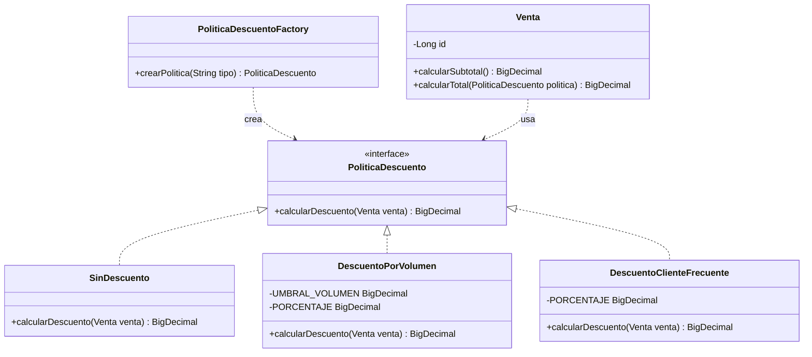

# P06: Selección y aplicación de patrones para el dominio de Ventas

* **Estatus:** Aprobado
* **Fecha:** 27 Septiembre 2026
* **Autores:** Juan Francisco, Victor Gustavo y Ana María

## 1. Problema del Dominio y Necesidad de Cambio
El cálculo de montos totales en la entidad `Venta` requiere aplicar diversas políticas de descuento comerciales (por volumen, clientes frecuentes, promociones temporales). Si estas reglas se codificaran con condicionales `if/else` dentro de la misma clase `Venta`, la entidad violaría el principio de Responsabilidad Única (SRP) y el principio Abierto/Cerrado (OCP), obligando a modificar la clase cada vez que el negocio introduzca una nueva promoción.

## 2. Comparación de Alternativas de Diseño

| Criterio | Condicionales Directos (`if/else`) | Patrón Strategy + Factory Method (Elegida) |
| :--- | :--- | :--- |
| **Mantenibilidad** | Deficiente. Acopla el cálculo de promociones a la clase `Venta`. | Alta. Cada política es una clase independiente que implementa `PoliticaDescuento`. |
| **Extensibilidad** | Nula. Requiere modificar `Venta.java` para cada nuevo descuento. | Excelente. Se agregan nuevas clases sin alterar `Venta` ni clases existentes. |
| **Pruebas Unitarias** | Complejas. Exige probar todas las combinaciones en la misma entidad. | Simples e independientes para cada política y para la fábrica [M06]. |
| **Costo / Complejidad** | Bajo en el corto plazo; inmanejable con el tiempo. | Ligero incremento en la cantidad de archivos (justificado por la variación) [M06]. |

## 3. Patrones Seleccionados e Implementados

1. **Strategy (`PoliticaDescuento`):**
   * Encapsula la familia de algoritmos de descuento (`SinDescuento`, `DescuentoPorVolumen`, `DescuentoClienteFrecuente`) permitiendo su intercambio dinámico en `Venta.calcularTotal(PoliticaDescuento)` [M06].
2. **Factory Method (`PoliticaDescuentoFactory`):**
   * Desacopla la instanciación de estrategias según el tipo de cliente o parámetro de entrada [M06].
## 4. Diagrama UML de Clases (Participantes)

### 5. Trazabilidad de Contribuciones Individuales
* **Integrante 1:** Definición de interfaz `PoliticaDescuento`, estrategias base (`SinDescuento`, `DescuentoPorVolumen`) e integración en `Venta` (Issue #1).
* **Integrante 2:** Nueva estrategia `DescuentoClienteFrecuente`, fábrica `PoliticaDescuentoFactory` y pruebas de extensión (Issue #2).
* **Integrante 3:** Gobernanza, redacción de `docs/P06-patrones.md`, pruebas de verificación y etiquetado `v0.6.0` (Issue #3).
